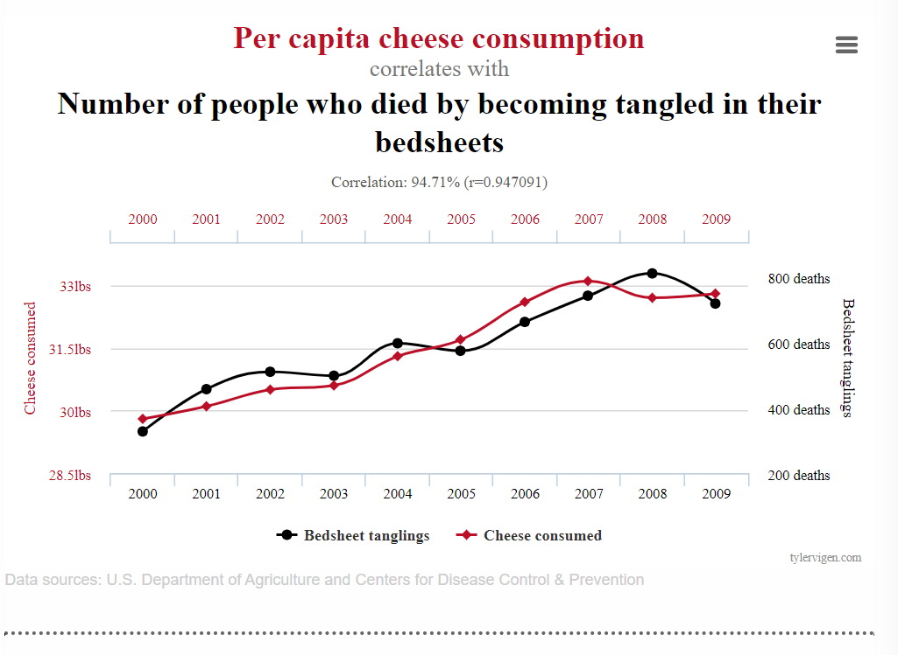
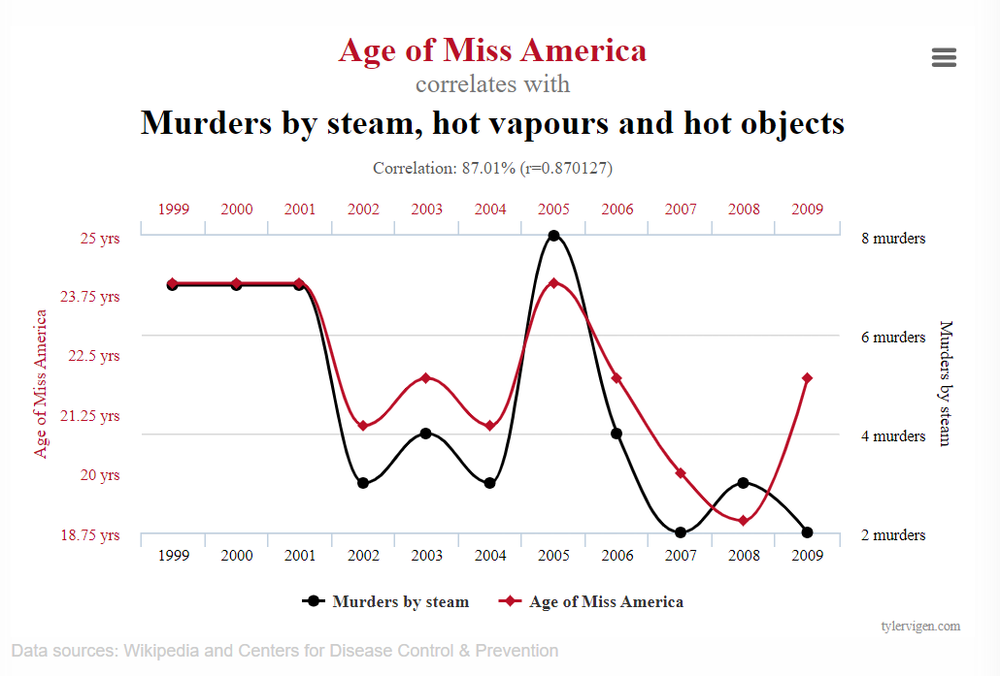

```{r setup, include=FALSE}
knitr::opts_chunk$set(echo = FALSE,message = F,warning = F,cache = T)
library(knitr)
```

##  Before we begin...

### I'm Brad Wakefield 

#### I'm a Statistical Consultant with the Statistical Consulting Centre here at UOW.

$\quad$

I'm going to run through some of the common misconceptions and mistakes that I have seen in my time here.

\*This list is not exhaustive and should be seen as a taster of some of the common problems in statistics.

# MISCONCEPTION 1

# Sample statistics are meaningless because they only relate to a portion of the population....

## What are Statistics?

### Statistics are functions of observable random variables.

-   A function is a relation or equation that takes in an input and generates an output.

-   Random variables are functions that generate **random** output (sample data).

-   Statistics are functions that take in observed random output as input and produce output.

## Why do we use Statistics?

In applied statistics, we usually consider two types of statistics.

-   **Descriptive statistics** - summarise particular aspects of the sample data.

-   **Inferential statistics** - make inference on an unknown population.

To apply inferential statistics we often need to have a **random sample**.

## Random Sample

A random sample is set of independent, identically distributed observations.

-   Independent means they were selected independently of other observations.

-   Identically distributed means they all came from the same population.

#### **The way data is collected can have dramatic consequences on the ability to make inference.**

## How to Estimate the Population?

Given a **random sample**,we can apply **probability theory** ...

```{r}
set.seed(16)
library(tidyverse)
library(gganimate)
n <- 100
nm <- 10
rate <- 0.2
Sample <- rexp(n*nm,rate)
xbar <- apply(array(Sample,dim=c(n,nm)),2,mean)
data <- data.frame(Sample,frame=rep(1:nm,each=n),df="Sample")
xbar_data <- data.frame(xbar,frame=1:nm,df="Sample Mean")
norm_bar <- data.frame(x=seq(3.5,6.5,length.out=21),
                       y=dnorm(seq(3.5,6.5,length.out=21),
                               1/rate,sd=1/(sqrt(n)*rate)),
                       df ="Sample Mean")
norm_bar <- norm_bar[rep(1:21,nm),]
norm_bar$frame <- rep(1:nm,each=21)

anim1 <- ggplot(data) +
  geom_histogram(aes(Sample,y=6.5*..density..),col='white',fill="#0072B2")+
  geom_bar(aes(x=x,y=y),stat ="identity",data=norm_bar,
           fill="#D55E00",col="white",alpha=0.5)+
  geom_segment(aes(x=xbar,xend=xbar),y=0,yend=1.1,
               col="#D55E00",size=2,alpha=1,data=xbar_data)+
  geom_text(aes(x=xbar,label=sprintf("%.1f", xbar)),y=1.2,
            col="#D55E00",data=xbar_data,size=6)+
  facet_grid(.~df,scales = "free")+
  theme(axis.text.y = element_blank(),
        axis.ticks.y = element_blank(), 
        axis.title = element_blank())+
  transition_states(frame)

n <- 100
nm <- 10
rate <- 6
shape <- 3
Sample <- 3-rgamma(n*nm,shape=shape,rate=rate)
xbar <- apply(array(Sample,dim=c(n,nm)),2,mean)
data <- data.frame(Sample,frame=rep(1:nm,each=n),df="Sample")
xbar_data <- data.frame(xbar,frame=1:nm,df="Sample Mean")
norm_bar <- data.frame(x=seq(2.4,2.6,length.out=21),
                       y=dnorm(seq(2.4,2.6,length.out=21),
                               3-shape/rate,sd=sqrt(shape)/(sqrt(n)*rate)),
                       df ="Sample Mean")
norm_bar <- norm_bar[rep(1:21,nm),]
norm_bar$frame <- rep(1:nm,each=21)

anim2 <- ggplot(data) +
  geom_histogram(aes(Sample,y=9*..density..),col='white',fill="#0072B2")+
  geom_bar(aes(x=x,y=y),stat ="identity",data=norm_bar,
           fill="#D55E00",col="white",alpha=0.5)+
  geom_segment(aes(x=xbar,xend=xbar),y=0,yend=16,
               col="#D55E00",size=2,alpha=1,data=xbar_data)+
  geom_text(aes(x=xbar,label=sprintf("%.2f", xbar)),y=17,
            col="#D55E00",data=xbar_data,size=6)+
  facet_grid(.~df,scales = "free")+
  theme(axis.text.y = element_blank(),
        axis.ticks.y = element_blank(), 
        axis.title = element_blank())+
  transition_states(frame)
```

```{r}
library(magick)
a_gif <- animate(anim1,height=300,width=300)
b_gif <- animate(anim2,height=300,width=300)
a_mgif <- image_read(a_gif)
b_mgif <- image_read(b_gif)

new_gif <- image_append(c(a_mgif[1], b_mgif[1]))
for(i in 2:50){
  combined <- image_append(c(a_mgif[i], b_mgif[i]))
  new_gif <- c(new_gif, combined)
}
new_gif
```

**Inferential statistics** have known probability distributions that relate to the population parameters.

# MISTAKE 1

# Sample mean, average, expected value, and mean are all the same thing!

## Population vs Sample

The term **mean** can apply to two different quantities.

+-------------+-----------------------------------------------------------------+------------------------------------------------------+
|             | **Population Mean**                                             | **Sample Mean**                                      |
+-------------+-----------------------------------------------------------------+------------------------------------------------------+
|             | -   Based on the entire population or theoretical distribution. | -   A calculable **statistic** based on sample data. |
|             |                                                                 |                                                      |
|             | -   Notated usually as $\mu$                                    | -   Notated usually as $\bar{x}$ or $\hat{\mu}$.     |
|             |                                                                 |                                                      |
|             | -   Is the **expected value** of the random variable.           | -   Is the average value in the sample.              |
+-------------+-----------------------------------------------------------------+------------------------------------------------------+

We use **sample mean** as an estimate of **population mean.**

*In notation we often place a hat on top of a population parameter* $\alpha$ *to symbolise an estimate* $\hat{\alpha}$*.*

# MISCONCEPTION 2

# Statistics can only be computed when I have numbers as my data.

## Qualitative Data

We often have qualitative data within our data sets.

That could be...

```{r}
head(ISLR::Wage[,2:5],5) %>% 
  kable(col.names = c("Age","Marital Status","Ethnicity","Education"))
```

## Qualitative Data

We often have qualitative data within our data sets.

Or it could be...

```{r}
qual_ex <- c("Patient experienced shortness of breath, pain in arm",
             "Pain was experienced by the patient in arm",
             "Patient exhibted a fever on arrival",
             "Coughing, sore throat, runny nose, fever")
qual_df <- data.frame(Name = c("John","Joe","Jane","Jack"),
           Age = c(52,47,32,19),Gender = c("Male","Male","Female","Male"),
           Symptoms=qual_ex) 
qual_df %>% kable()
```

## Qualitative Data

To analyse this data we need to use **appropriate** statistics.

```{r}
table(ISLR::Wage$education) %>% kable(col.names = c("Education","Frequency"))
```

Workers with college or advanced degree make up `r round(sum(table(ISLR::Wage$education)[4:5])/30)`% of workers in data set.

## Qualitative Data

Or we need to compute some variables first...

```{r}
qual_df$pain <- c("Yes","Yes","No","No")
qual_df$fever <- c("No","No","Yes","Yes")
colnames(qual_df)[5:6] <- c("Pain in Arm?","Has Fever?")
qual_df %>% kable()
```

# MISTAKE 2

# Treating qualitative data as quantitative data.

## Analysing Qualitative Data

**DO**

-   Use frequency and contingency tables.

-   Calculate modes and proportions.

-   To compare differences in other variables across different groups.

-   Use logistic regression (when a dependent variable).

-   Use bar plots to visualise or boxplots when comparing groups across a quantitative variable.

-   Treat it as a qualitative variable in analysis.

## Analysing Qualitative Data

**DO NOT**

-   Compute mean, median, variance, standard deviation.

-   Calculate correlations (unless ordinal).

-   Fit a linear regression (when a dependent variable).

-   Visualise with a line graph or scatterplot (unless ordinal).

-   Treat it as a quantitative variable in analysis.

# MISCONCEPTION 3

# My data is "representative" because I have a large sample size.

## What Makes Data Representative?

```{r,fig.height=4}
sam_des_df <- data.frame(count = c(90,10,5,95),
                         cool =factor(c("Cool","Uncool","Cool","Uncool")),
           survey = rep(c("Survey of 100 statisticians",
                          "Survey of 100 members of the general public"),each=2))

ggplot(sam_des_df) + 
  geom_bar(aes(x=cool,y=count,fill=cool),
           stat="identity",show.legend = F) + 
  facet_grid(.~survey)+
  labs(title = "Survey: Do you think statisticians are cool?",
       subtitle = "What is more representative...",y="Frequency",x="")
```

Asking more statisticians won't make me any cooler.

## What Makes Data Representative?

**Sampling design** refers to how observations are selected or measured from the population.

-   Probability samples - chosen from a population using probability theory.

-   Non-probability samples - chosen from a population by convenience or some other non-random mechanism.

A good sampling design leads to representative data.

#### To make reliable inference, your target population should match your sampling frame as best as possible.

## Does Sample Size Really Matter?

### **Yes - sample size does still matter.**

$\quad$

#### Increasing sample size reduces **sampling error.**

$\quad$

Sampling error is the difference between the population parameter and the sample estimate as a result of it being from a sample.

Sampling error does not account for mistakes in the sampling design or collection leading to unrepresentative data. This is called **non-sampling error**.

# MISTAKE 3

# Over-fitting models using insufficient data.

## What is Over-Fitting?

**Over-fitting** is the process of performing analysis too "closely" to an insufficient number of data points leading to non-generalisable results.

```{r,fig.height=2}
set.seed(16)
df <- data.frame(X=rnorm(20))
df$Y <- 0.9*df$X^2 + runif(20,-1,1)

g1 <- ggplot(df,aes(X,Y))+geom_point()+
  geom_smooth(method='lm',se=F)+
  labs(title="Under-Fitting Model")+
  theme(plot.title = element_text(hjust=0.5))
g2 <- ggplot(df,aes(X,Y))+geom_point()+
  geom_smooth(se=F,span=2)+
  labs(title="Well-Fitting Model")+
  theme(plot.title = element_text(hjust=0.5))
g3 <- ggplot(df,aes(X,Y))+geom_point()+
  geom_smooth(se=F,span=0.1)+
  labs(title="Over-Fitting Model")+
  theme(plot.title = element_text(hjust=0.5))

ggpubr::ggarrange(g1,g2,g3,ncol = 3)
```

Over-fit models have too many parameters needing to be estimated then data available to estimate them.

## What Size is Sufficient?

### THINK BEFORE FITTING

-   What are the different sub-groups I'm modeling?

-   Have I got enough observations in each sub-group to get a general idea?

-   Should I simplify my model?

**Example:** Suppose I want to model income based on age, education level, gender, country of birth ...

#### There are calculations and rules of thumb for each analysis which can help decide.

# MISCONCEPTION 4

# My data needs to be normally distributed to analyse.

## Parametric Assumptions

A **parametric** assumption refers to an assumption about how our distribution is "parameterised."

For many common statistical analyses, parametric assumptions are often used.

We use parametric assumptions to simplify problems, have more certainty in estimates, and be more conclusive about differences.

### ALWAYS CHECK THE SPECIFIC ASSUMPTIONS OF YOUR ANALYSIS

## The Normal Assumption

Some analyses require normal distributed data.

-   e.g. t-tests, ANOVA, pearson correlations, etc

Some analyses require aspects (like residuals) to be normally distributed, but not the actual data.

-   e.g. **linear regression**, ARIMA modelling etc.

Some analyses do not have a parametric assumption (non-parametric) ... but they do have others.

-   e.g. Wilcoxon test, Mann-Whitney test, Kruskal-Wallis test, etc.

# MISTAKE 4

# Not checking assumptions.

## Checking Assumptions

**There are often more than just normal distribution assumptions to models to consider.**

Other assumptions include:

-   Constant variances, homogeneity of variance, homoscedasticity,...

-   Independence between observations ...

-   Sufficient sample sizes (are asymptotic methods) ...

-   Linearity and no multicolineraity ...

**All relevant assumptions should be checked.**

# MISCONCEPTION 5

# In hypothesis testing, we prove hypotheses to be true.

## What is Hypothesis Testing?

Hypothesis testing is a statistical analysis used to determine whether there is sufficient statistical evidence to reject a specific statement (null hypothesis) about a population parameter or distribution.

**We do not prove things.**

At the conclusion of a hypothesis test we either,

-   Conclude that we have sufficient evidence to reject a null hypothesis.

-   Conclude that we do not have sufficient evidence to reject a null hypothesis.

    -   Does not mean the null hypothesis is true.

## The Logic of a Hypothesis Test

We begin every hypothesis test with two hypotheses.

e.g. a null $H_0: \mu =10$ vs an alternate $H_1:\mu \neq 10$.

We **assume the null hypothesis is true.**

We compute a **test statistic** e.g. $T = 2.65$.

Given the null hypothesis and the assumptions of the test, we know the **probability distribution** of the test statistic. (e.g. $T \sim t_{9}$)

## The Logic of a Hypothesis Test

Given a significance level ($\alpha$), we determine the "extremes" of our test statistic distribution.

```{r,fig.height=3,fig.width=5.5,fig.align='center'}
library(latex2exp)
t_df <- data.frame(x=seq(-3.5,3.5,length.out = 21))
t_df$density <- dt(t_df$x,df=9)
t_df$reject <- factor(abs(t_df$x) > qt(0.975,df=9),levels = c(T,F))
levels(t_df$reject) <- c("Rejection Region","Retension Region")
ggplot(t_df) + geom_bar(aes(x=x,y=density,fill=reject),stat="identity") +
  labs(fill = "",x="Test Statistic Values",y="Probability Density")+
  annotate("text",x=2.5,y=0.3,
           label="Size of Rejection Region \n(Significance Level)")+
    annotate("text",x=2.5,y=0.2,label=TeX('\\alpha = 0.05'))+
  theme(legend.position = "top")
```

The most extreme values with a combined area that add up to $\alpha$ belong to the rejection region.

## The Logic of a Hypothesis Test

If our observed test statistic value falls within the rejection region...

```{r,fig.height=2.5,fig.width=5,fig.align='center'}
library(latex2exp)
t_df <- data.frame(x=seq(-3.5,3.5,length.out = 21))
t_df$density <- dt(t_df$x,df=9)
t_df$reject <- factor(abs(t_df$x) > qt(0.975,df=9),levels = c(T,F))
levels(t_df$reject) <- c("Rejection Region","Retension Region")
ggplot(t_df) + geom_bar(aes(x=x,y=density,fill=reject),stat="identity") +
  geom_segment(x=2.65,xend=2.65,y=0,yend=0.2,size=2)+
  labs(fill = "",x="Test Statistic Values",y="Probability Density")+
  theme(legend.position = "top")+ annotate("text",x=2.65,y=0.25,label="T=2.65")
```

-   Our observed value is extreme and not consistent with what is expected (were our null hypothesis true).

-   Evidence suggests our null hypothesis is not true.

# MISTAKE 5

# $p$-values are the probability of our null hypothesis being true.

## What are $p$-values?

$p$-values are often used with statistical software to perform hypothesis testing.

$p$**-values are the probability, under the null hypothesis, of achieving test statistic values at least as extreme as the result actually observed.**

```{r,fig.height=2.5,fig.width=5,fig.align='center'}
t_df <- data.frame(x=seq(-3.5,3.5,length.out = 21))
t_df$density <- dt(t_df$x,df=9)
t_df$reject <- factor(abs(t_df$x) > 2.65,levels = c(T,F))
levels(t_df$reject) <- c("p-value area","1-p-value area")
ggplot(t_df) + geom_bar(aes(x=x,y=density,fill=reject),stat="identity") +
  geom_segment(x=2.65,xend=2.65,y=0,yend=0.2,size=2)+
  geom_segment(x=-2.65,xend=-2.65,y=0,yend=0.2,size=2)+
  labs(fill = "",x="Test Statistic Values",y="Probability Density")+
  theme(legend.position = "top")+ annotate("text",x=2.65,y=0.25,label="T=2.65")+
  annotate("text",x=-2.65,y=0.25,label="-T=-2.65")
```

$\qquad \qquad \qquad \qquad$The total area in orange the $p$-value.

## What are $p$-values?

To determine whether to reject a null hypothesis,

**If** $p$-value $\leq \alpha$ **reject the null hypothesis.**

**If** $p$-value $> \alpha$ **do not** **reject the null hypothesis.**

Consider the $p$-value for the value below.

```{r,fig.height=2.5,fig.width=5,fig.align='center'}
library(latex2exp)
t_df <- data.frame(x=seq(-3.5,3.5,length.out = 21))
t_df$density <- dt(t_df$x,df=9)
t_df$reject <- factor(abs(t_df$x) > qt(0.975,df=9),levels = c(T,F))
levels(t_df$reject) <- c("Rejection Region","Retension Region")
ggplot(t_df) + geom_bar(aes(x=x,y=density,fill=reject),stat="identity") +
  geom_segment(x=2.65,xend=2.65,y=0,yend=0.2,size=2)+
  labs(fill = "",x="Test Statistic Values",y="Probability Density")+
  theme(legend.position = "top")+ annotate("text",x=2.65,y=0.25,label="T=2.65")
```

# MISCONCEPTION 6

# There is a large difference in mean so they are significantly different.

## "Significance" is Significant

In statistics, **significant** means "significant with respect to some hypothesis test and significance level".

Do not use the term **significant** unless you have performed a hypothesis test.

Statistical significant results account for the size of the difference relative to the variation in the data.

Results with large differences in mean can be described as "considerable" but not significant.

## "Significance" is Significant

**Example 1**

Consider the difference between 100 observations of the two variables $X\sim N(200,1000^2)$ and $Y\sim N(300,1000^2)$.

```{r}
set.seed(10)
X1 <- rnorm(100,200,sd=1000)
Y1 <- rnorm(100,300,sd=1000)
```

With sample means $\bar{x} = 63 \text{ and } \bar{y}= 205$.

Performing a Students' t-test we conclude there **is not a significant difference** in means.

## "Significance" is Significant

**Example 2**

Consider the difference between 100 observations of the two variables $X\sim N(2.1,1^2)$ and $Y\sim N(2.5,1^2)$.

```{r}
set.seed(10)
X2 <- rnorm(100,2.1,sd=1)
Y2 <- rnorm(100,2.5,sd=1)
```

With sample means $\bar{x} = 1.96 \text{ and } \bar{y}= 2.40$.

Performing a Students' t-test we conclude there **is a significant difference** in means.

## Confidence Interval Plots

To get a better sense of the differences between these two examples we can look at the 95% confidence interval plot.

```{r,fig.height=3,fig.width=6,fig.align='center'}
ci1 <- data.frame(val=c(X1,Y1,X2,Y2),variable = rep(c("X","Y","X","Y"),each=100),
           example = rep(c("Example 1","Example 2"),each=200))
ci1 %>% group_by(variable,example) %>% 
  summarise(mu = mean(val),
            lci = mean(val)-qt(0.975,df=99)*sd(val)/sqrt(100),
            uci = mean(val)+qt(0.975,df=99)*sd(val)/sqrt(100)) %>%
  ggplot(aes(y=variable,col=variable))+
  geom_point(aes(x=mu),size=5,show.legend = F)+
  geom_errorbar(aes(xmin=lci,xmax=uci),size=2,show.legend = F)+ 
     facet_grid(.~example,scales = "free_x")+
  labs(x="",y="")
```

You have to take into account variation in the data!

# MISTAKE 6

# There is a 95% probability the true value falls within my 95% confidence interval. 

## What is a Confidence Interval?

A 95% confidence interval for a parameter is an interval, based on sample statistics, that if we were to repeatedly compute for different random samples of the population indefinitely would contain the true parameter value 95% of the time.

-   The true value of a parameter is **not** **random** in frequentist statistics.

-   Computing probabilities of the true value being any value(s) **does not make sense**.

-   Confidence intervals give a sense of the uncertainty in the estimate within the scale of the estimate.

-   Some statisticians and journals prefer CIs over $p$-values.

# MISCONCEPTION 7

# I need to have statistical significance in order to have a result.

## The $p$-Hacking Problem

Many researchers feel the need to have statistically significant results.

**Non-statistically significant results are still a result** (but should not be over interpreted).

We should select statistical models to test based on **what is best for the research objective**.

### Changing your analysis so you get a significant result is not just bad stats, it's unethical. 

# MISTAKE 7

# Testing multiple models to see what differences are significant (without correction).

## The False Positive Bias

When we incorrectly reject a null hypothesis (incorrectly claim a significant difference), we have a type I error - **a false positive**.

If we were to use a significance level of $\alpha=0.05$, and repeat a hypothesis test on 100 different samples where the null hypothesis is actually true, we would expect to make type I error 5% of the time (1 in 20).

It follows that the more tests you do ... the more chance you obtain a **false positive result**.

Hypothesis testing should be planned sparingly. If multiple comparisons are used **a Bonferroni correction** should be applied.

# MISCONCEPTION 8

# CORRELATION IS NOT CAUSATION

## Correlation vs Causation

**Correlation** is a statistical measure (expressed as a number) that describes the size and direction of a relationship between two or more variables.

A linear correlation between two variables suggests as one increase, the other increases (if positively correlated) or decreases (if negatively correlated).

**Causation** indicates that one event is the result of the occurrence of the other event; i.e. there is a causal relationship between the two events.

**A correlation between variable X and Y does not mean X causes Y (or vice versa).**

## Spurious Correlations

{width="590"}

Source: <https://www.tylervigen.com/spurious-correlations>

## Spurious Correlations

{width="596"}

Source: <https://www.tylervigen.com/spurious-correlations>

## Correlation vs Causation

In order to make **causal inference** we usually need to conduct an experiment or a controlled study.

A controlled study involves controlling external sources of variation and performing a specidic intervention.

Inference around **correlation** can be made on uncontrolled studies.

Implementing a good **study or experimental design** ensures you can make quality inference.

## What makes a good study?

Here are some important things to consider to make quality inference.

-   If testing the effect of an intervention, **a control group** is needed.

-   Remove / control **confounding factors**

-   Use sufficient sample size.

-   Randomisation is key to ensure generalisability.

-   Have a good sampling design.

-   **Replication** and **reproducibility**.

# MISTAKE 8

# Circular analysis and inflated sample sizes.

## What is Circular Analysis?

Circular analysis is any analysis that **retrospectively** selects features of the data to characterise variables of interest resulting in a distortion of the statistical analysis,

Circular analysis is sometimes called **double dipping**.

Researchers are at risk of performing circular analysis when they manipulate data into groups after already performing analysis,

**Consider the following example...**

## What is Circular Analysis?

**Suppose I did a study on the effectiveness of a specific medication in treating memory loss.**

I compare pre treatment memory scores of 100 subjects to their post treatment memory loss score.

I found that 50 people saw improvements in their memory scores and 50 people did not.

Overall there was not a significant improvement in memory score across the 100 participants.

I group the data into two groups 1. those that had an improvement and 2. those who did not.

I get a significant difference in memory scores in group 1.

## Degrees of Freedom

**The degrees of freedom** of a statistical analysis are the maximum number of logically independent values, which are values that have the freedom to vary, in the data sample.

Degrees of freedom can be thought of as the number of independent pieces of information used to obtain an estimate.

**Consider the sample variance:**

$$
s^2 = \frac{1}{n-1}\sum_{i=1}^n(x_i-\bar{x})^2
$$

This estimate has $n-1$ degrees of freedom.

## Inflating Sample Sizes

The **experimental uni**t is the smallest observation that can be randomly assigned.

The **observational unit** is the smallest level in which a measurement is taken.

In longitudinal studies, the experiment unit is each subject / participant, the observation unit is each recorded measurement within each subject.

The number of **experimental units** should be used when considering degrees of freedom (minus the number of parameters estimated).

Using the number of observations units artificially inflates the sample size.

## Inflating Sample Sizes

### Recording more observations from the same experimental unit does not reduce the number of experimental units required.

$\quad$

Asking 10 people 100 questions is not the same as asking 100 people 10 questions.

# MISCONCEPTION 9

# At UOW you cannot get help with your statistical analysis.

## We're here to help...

{width="602"}

#### Aim

The service aims to improve the statistical content of research carried out by members of the University. Researchers from all disciplines may use the Centre. Priority is currently given to staff members and postgraduate students undertaking research for Doctor of Philosophy or Masters' degrees.

## We're here to help...

#### How can we help?

Currently the Statistical Consulting Centre provides each post-graduate student with a free initial consultation. Up to ten hours per calendar year of consulting time is provided without charge if research funding is not available. When students require more consulting time, or receive external funding, a service charge may be necessary.

#### What do we help with?

+--------------------------------------+--------------------------------------+
| -   **The planning of experiments,** | -   **Data entry and management,**   |
|                                      |                                      |
| -   **Designing questionnaires,**    | -   **Statistical analyses,**        |
|                                      |                                      |
| -   **Data collection,**             | -   **The presentation of results.** |
+--------------------------------------+--------------------------------------+

## To book a consultation...

{width="820"}

### {width="825"}

{width="825" height="41"}

**Just Google NIASRA and follow the prompts!**

## Any other queries...

{width="825"}
